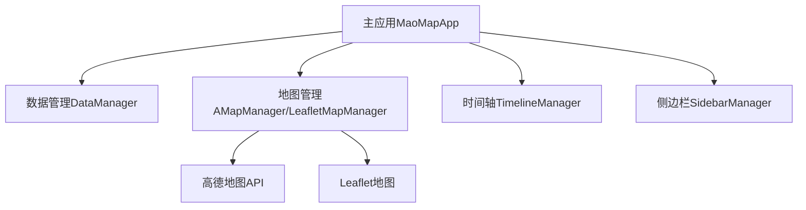

# 毛主席生平足迹地图架构评估报告

## 1. 架构概述

## 2. 架构评估

### 模块化程度 (评分: 8/10)
- **优势**：
  - 功能模块划分清晰
  - ES6模块化组织
  - 地图提供商可插拔设计
- **改进建议**：
  - 引入正式模块接口定义
  - 使用依赖注入解耦

### 可扩展性 (评分: 7/10)
- **优势**：
  - 支持多地图提供商
  - 事件驱动架构
  - 配置化管理
- **改进建议**：
  - 完善Leaflet实现
  - 抽象通用地图接口

### 性能考量 (评分: 8/10)
- **优势**：
  - API懒加载
  - 动画优化
  - 数据缓存
- **改进建议**：
  - 增加Web Worker
  - 优化大数据渲染

### 可维护性 (评分: 8/10)
- **优势**：
  - 代码结构清晰
  - 文档完整
  - 配置分离
- **改进建议**：
  - 增加单元测试
  - 完善代码注释

## 3. 技术债务

| 问题 | 优先级 | 改进建议 | 难度 |
|------|--------|----------|------|
| Leaflet实现不完整 | 高 | 完整实现Leaflet接口 | 中 |
| 地图接口抽象不足 | 中 | 定义统一接口+工厂模式 | 中 | 
| 动画性能问题 | 低 | 轨迹简化+帧率控制 | 高 |

## 4. 演进路线

**0-2个月**  
- 完成Leaflet实现
- 增加单元测试
- 移动端优化

**2-4个月**  
- 地图接口抽象  
- Web Worker支持
- 状态管理

**4-6个月**  
- 3D地图支持
- AR/VR体验
- 教育版本开发